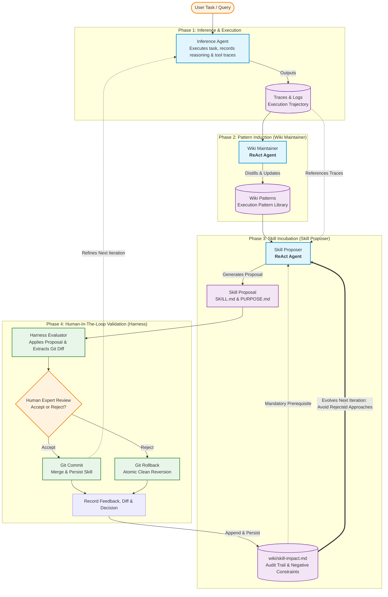
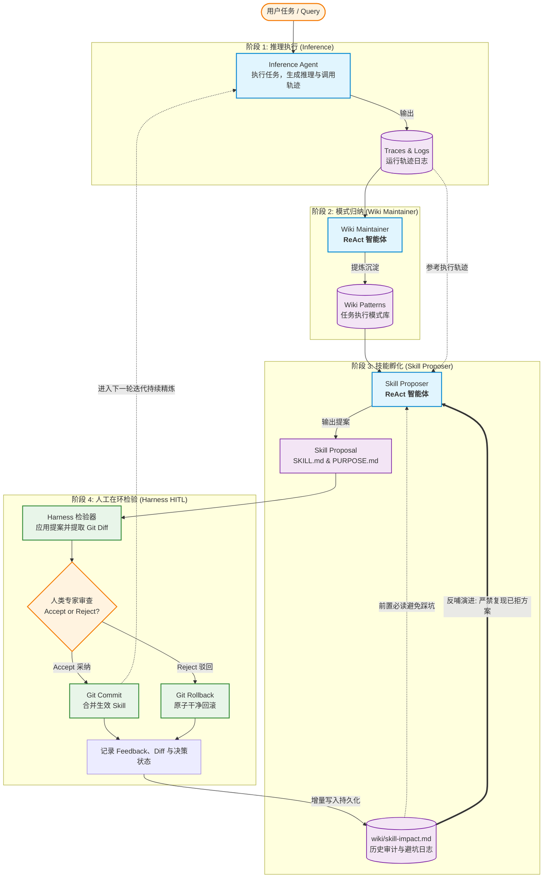

# A-Skill-Trainer

> **Skill Incubation and Training Framework via ReAct Agent Collaboration and Human-In-The-Loop**  
> **基于 ReAct 智能体协同与 Human-In-The-Loop 的技能孵化训练器**

---

## 📑 Table of Contents / 目录导航

| 🇬🇧 English Contents | 🇨🇳 中文目录 |
| :--- | :--- |
| 1. [💡 Inspiration & Philosophy](#en-inspiration) | 1. [💡 灵感与设计哲学](#zh-inspiration) |
| 2. [🏛️ Core Architecture & Roles](#en-architecture) | 2. [🏛️ 核心架构与角色分工](#zh-architecture) |
| 3. [🔄 Working Mechanism (Pseudo-Code)](#en-mechanism) | 3. [🔄 核心工作机制（While-Iteration 伪代码）](#zh-mechanism) |
| 4. [🐣 Easter Egg: Antigravity Engine](#en-easter-egg) | 4. [🐣 实验性彩蛋：Antigravity 推理引擎](#zh-easter-egg) |
| 5. [🛠️ Prerequisites & Installation](#en-installation) | 5. [🛠️ 安装与环境要求](#zh-installation) |
| 6. [🚀 Quickstart & Walkthrough](#en-quickstart) | 6. [🚀 运行与快速上手](#zh-quickstart) |

---

<a id="english-version"></a>
# English Version

**A-Skill-Trainer** is an experimental training framework designed to incubate and iteratively evolve agent skills for complex tasks. By orchestrating multi-agent collaboration among **Inference Execution (Inference Agent)**, **Execution Pattern Extraction (Wiki Maintainer)**, and **Skill Proposal Incubation (Skill Proposer)**, combined with an outer **Human-In-The-Loop (HITL)** inspection mechanism, it enables continuous refinement and convergence of skills for specific task categories.

---

<a id="en-inspiration"></a>
## 💡 Inspiration & Design Philosophy

The core concept of this project originates from the insights and inspiration of two frontier research papers:
1. **[WikiSkill (arXiv:2608.27454v1)](https://arxiv.org/abs/2608.27454)**: Provided the architectural concept of maintaining an execution pattern "Wiki" to decouple knowledge extraction from skill storage;
2. **[Agent Skills Can Be Harmful (arXiv:2608.11888v1)](https://arxiv.org/abs/2608.11888)**: Empirically demonstrated that unvetted, low-quality skills can induce task failures, waste tokens/time, and even cause performance degradation (skill toxicity and harmfulness). Alarmed and motivated by these findings, we recognized the urgent necessity for a tightly controlled skill incubation methodology—introducing **Human-In-The-Loop (HITL)** with human expert inspection and continuous feedback to tame, shape, and rigorously validate skills for specific task domains, ensuring they are truly robust, effective, and harmless.

> ⚠️ **Important Note**:
> This project is **not a naive reproduction of the paper**, but rather inherits WikiSkill's spiritual essence while introducing original engineering designs to solve the aforementioned problems:
> - **HITL Safeguard Against Skill Toxicity**: Inspired by *Agent Skills Can Be Harmful*, an external Harness mechanism was introduced where human expert critical feedback directly steers skill evolution;
> - **ReAct Architecture Upgrade**: In the original WikiSkill paper, the Maintainer operated as a standard agent without ReAct. In this project, leveraging **LangChain DeepAgents**, we upgraded **Wiki Maintainer into a fully equipped ReAct agent** (with Skill Proposer also operating via ReAct), and redesigned their system prompts accordingly;
> - **Closed-Loop Audit Trail**: Harness extracts the ground-truth `git diff` for each skill change, records human `Accept / Reject` decisions alongside concrete `Feedback` into the persistent audit document `skill-impact.md`, strictly preventing subsequent iterations from repeating rejected patterns.

---

<a id="en-architecture"></a>
## 🏛️ Core Architecture & Role Division

The framework operates via three core agents orchestrated alongside an external human adjudication mechanism (Harness):



1. **Inference Agent**:
   - Default engine: **LangChain DeepAgents** (powered by Google Vertex AI Gemini 3.8 Flash).
   - Executes specific tasks using currently available skills, logging execution status, tool calls, and detailed reasoning traces.
2. **Wiki Maintainer (ReAct Agent)**:
   - Analyzes execution traces generated during inference, abstracting reusable execution paradigms (Patterns) and writing them to `workspace/wiki/patterns/`.
3. **Skill Proposer (ReAct Agent)**:
   - Synthesizes task traces, Wiki patterns, and past audit records (`skill-impact.md`) to incubate new skills or patch existing ones (generating `SKILL.md` and `PURPOSE.md`).
4. **Harness (HITL Gatekeeper)**:
   - Acts as the outer arbiter; applies proposals to the skill directory;
   - Leverages underlying Git to extract exact modification diffs (`git diff`);
   - Captures human `accept` or `reject` verdicts and actionable feedback;
   - Commits changes on accept, or executes atomic clean rollback (`git checkout / clean`) on reject;
   - Appends iteration number, decision, feedback, rationale, and git diff into `workspace/wiki/skill-impact.md`, establishing an audit trail that informs subsequent proposer iterations.

---

<a id="en-mechanism"></a>
## 🔄 Working Mechanism (While-Iteration Pseudo-Code)

Skills evolve iteratively through continuous refinement. The pseudo-code below integrates the general `while` loop control structure with the concrete progression from **Round 0 to Round 4** demonstrated in the walkthrough script:

```python
def train_skill_lifecycle(task_id, task_name, query):
    iteration = 0
    max_rounds = 5
    skill_converged = False

    while iteration < max_rounds and not skill_converged:
        print(f"=== Starting Iteration {iteration} ===")

        # 1. Inference Agent executes task and logs traces
        traces = run_inference_agent(task_id, task_name, query, skills_dir="./workspace/skills")
        session_id = get_latest_session_id()

        # 2. Wiki Maintainer (ReAct) extracts execution patterns
        run_wiki_maintainer(traces_dir=traces, wiki_dir="./workspace/wiki")

        # 3. Skill Proposer (ReAct) generates skill proposal
        # (Reads wiki/skill-impact.md to avoid previously rejected approaches)
        proposal = run_skill_proposer(session_id, task_id, workspace_dir="./workspace")

        # 4. Harness applies proposal and extracts Git Diff
        harness.apply(proposal_path=proposal_path, skills_dir=skills_dir)
        harness.get_diff(workspace_dir_abs_path)

        # 5. Human-In-The-Loop evaluation and feedback
        # --- Concrete Evolution Walkthrough (Weather Retrieval Example) ---
        if iteration == 0:
            # Round 0: Initial proposal is purely text-based, lacking script automation
            reject = True
            feedback = "It is better to use some scripts to support"
        elif iteration == 1:
            # Round 1: Proposer introduces initial script; passes review but needs robustness
            reject = False
            feedback = "Make the scripts more robust"
        elif iteration == 2:
            # Round 2: Error handling refined; human requests pinned dependency versions
            reject = False
            feedback = "Add requirements (libs strong versions) that the scripts can work with"
        elif iteration == 3:
            # Round 3: Dependencies incomplete and lacking examples; rejected for rework
            reject = True
            feedback = "Enhance requirements(libs) installation descriptions and add more examples, potential errors or walkarounds"
        elif iteration == 4:
            # Round 4: Highly mature skill with complete scripts, pinned deps, and fallbacks; accepted
            reject = False
            feedback = "Skill accepted as robust standard"
            skill_converged = True

        # 6. Apply verdict and persist audit trail
        harness.accept_or_reject(workspace_dir_abs_path, skills_dir, reject)
        harness.update(
            wiki_dir,
            feedback=feedback,
            iteration=iteration,
        )

        iteration += 1
```

---

<a id="en-easter-egg"></a>
## 🐣 Easter Egg: Antigravity Headless Inference Engine

In addition to the default **LangChain DeepAgents**, this project features an experimental easter egg:
- Supports utilizing **Google Antigravity SDK** (running in `headless` mode) as the underlying inference engine (`trainer/inference_antigravity.py`).
- Run the dedicated script `flow-antigravity-proposal-harness.sh` to experience Antigravity-driven task execution and trace collection.

---

<a id="en-installation"></a>
## 🛠️ Prerequisites & Installation

### 1. Prerequisites
1. **Git (Mandatory)**:
   - Git **must be installed on the host machine**.
   - Harness relies on `git diff` to capture skill modifications, and uses `git checkout / clean` on rejection to achieve atomic, clean rollback.
2. **Python 3.10+** and a virtual environment.
3. **Optional: Antigravity CLI**:
   - Required only if you wish to run the Antigravity SDK easter egg mode.

### 2. Installation Steps

```bash
# 1. Clone the main repository and enter directory
git clone https://github.com/XinyueZ/a-skill-trainer.git
cd a-skill-trainer

# 2. Clone the workspace repository into 'workspace'
# (The 'workspace' is an independent Git repository used by Harness to track skill diffs and manage rollbacks)
git clone https://github.com/XinyueZ/a-skill-trainer-workspace.git workspace

# 3. Install Python dependencies
pip install -r requirements.txt
```

### 3. Environment Configuration (`.env`)

Sensitive credentials and model parameters are kept in local configuration. A template file `.env.example` is provided:

```bash
cp .env.example .env
```

Key `.env` parameters:
```ini
# GCP & Vertex AI Credentials
GOOGLE_CLOUD_PROJECT="your-gcp-project-id"
GOOGLE_GENAI_USE_VERTEXAI=True
GOOGLE_GENAI_USE_ENTERPRISE=True
GEMINI_API_KEY="your-gemini-api-key"

# Model Configuration (Gemini 3.8 Flash series)
INFERENCE_MODEL="gemini-3.8-flash"
INFERENCE_MODEL_LOCATION="eu"

WIKI_MANTANCER_MODEL="gemini-3.8-flash"
WIKI_MANTANCER_MODEL_LOCATION="eu"

SKILL_PROPOSER_MODEL="gemini-3.8-flash"
SKILL_PROPOSER_MODEL_LOCATION="eu"

# Thinking & Recursion Settings
THINKING_LEVEL="high"
INCLUDE_THOUGHTS=True
LANGGRAPH_RECURSION_LIMIT=999
```

---

<a id="en-quickstart"></a>
## 🚀 Quickstart & Walkthrough

### 1. Terminal Walkthrough Scripts

Two end-to-end walkthrough scripts are provided in the root directory. Ready-to-run commands are documented in the file headers:

- **Standard Pipeline (DeepAgents Inference Engine)**:
  ```bash
  ./flow-inference-proposal-harness.sh --task_id 1 --task_name "walk-through-inference-proposal-harness" --query "Current realtime weather in Hamburg Germany please.  Warning: it must be a **SIMPLE** json structure (location, condition, temperature_celsius, apparent_temperature_celsius, humidity_percent, wind_speed_kmh, precipitation_mm, timestamp(germany format dd.mm.yyyy hh:mm)) and saved in sandbox_output/<session-id>/findings.json"
  ```

- **Easter Egg Pipeline (Antigravity SDK Headless Engine)**:
  ```bash
  ./flow-antigravity-proposal-harness.sh --task_id 1 --task_name "walk-through-antigravity-proposal-harness" --query "Current realtime weather in Hamburg Germany please. Warning: it must be a **SIMPLE** json structure (location, condition, temperature_celsius, apparent_temperature_celsius, humidity_percent, wind_speed_kmh, precipitation_mm, timestamp(germany format dd.mm.yyyy hh:mm)) and saved in sandbox_output/<session-id>/findings.json"
  ```

### 2. Streamlit Web UI

If you prefer inspecting traces, patterns, skill diffs, and submitting approvals visually:

```bash
streamlit run app.py
```
*(Note: The Streamlit interface is in early experimental stages and relatively unpolished, but provides full visibility into trajectories and review states.)*

### 3. Utility Scripts

- `./reset-workspace.sh --dir ./workspace`: Hard resets the `workspace` Git repository back to its initial commit, wiping uncommitted changes.
- `./clean-all-outputs.sh`: Cleans all intermediate artifacts and session logs in `output/` and `sandbox_output/`.

---
---

<a id="中文版本"></a>
# 中文版本

**A-Skill-Trainer** 是一个面向复杂任务技能（Skill）孵化与演进的实验性训练框架。通过 **推理执行（Inference）**、**执行模式总结（Wiki Maintainer）** 与 **技能提案孵化（Skill Proposer）** 的多智能体协同，并在外部引入 **人类在环检验（Human-In-The-Loop, HITL）**，实现针对特定任务类型的技能持续迭代与打磨。

---

<a id="zh-inspiration"></a>
## 💡 灵感与设计哲学

本项目的核心思想起源于两篇前沿研究论文的启发与感召：
1. **[WikiSkill (arXiv:2608.27454v1)](https://arxiv.org/abs/2608.27454)**：提供了通过构建“任务模式维基（Wiki）”来解耦知识提炼与技能沉淀的精神参考；
2. **[Agent Skills Can Be Harmful (arXiv:2608.11888v1)](https://arxiv.org/abs/2608.11888)**：深入实证揭示了粗制滥造或未经严密检验的 Skill 反而会导致智能体出现任务执行失败、Token 与耗时浪费甚至性能负优化（即“技能有害性”）。正是受该论文的警示与感召，我们深感必须寻找一种严密受控的技能孵化方法——通过引入 **Human-In-The-Loop (HITL)** 让人类专家介入审查把关并给予持续 Feedback，从而定向驯化、严格验收针对某一类型的特定技能（Skill），确保其真正高鲁棒且无害。

> ⚠️ **重要说明**：
> 本项目**并非论文的刻板复现**，而是吸收了 WikiSkill 的精神精髓并融入了作者针对上述痛点的原创工程设计：
> - **针对技能有害性的 HITL 把关机制**：将人类专家作为核心裁判引入 Harness，通过多轮决策与反馈，彻底杜绝劣质技能污染智能体；
> - **ReAct 架构升级**：在 WikiSkill 原论文中，Maintainer 仅作为普通 Agent 工作，未引入 ReAct。而在本项目中，我们充分利用 **LangChain DeepAgents** 的框架优势，将 **Wiki Maintainer 升级为完整的 ReAct 智能体**（Proposer 亦保持 ReAct），并对其 System Prompts 进行了深度调优与适配；
> - **闭环审计系统**：通过 Harness 捕获每次 Skill 变更的真实 `git diff`，并结合人类的 `Accept / Reject` 决策与 `Feedback` 写入持久化审计文档 `skill-impact.md`，杜绝后续轮次重复踩坑。

---

<a id="zh-architecture"></a>
## 🏛️ 核心架构与角色分工

项目由三个核心智能体与一个外部人类裁决机制（Harness）协同工作：



1. **Inference Agent（推理执行体）**：
   - 默认采用 **LangChain DeepAgents**（基于 Google Vertex AI Gemini 3.8 Flash）。
   - 在已有 Skills 的赋能下执行具体任务，记录详细的工具调用、执行状态与推理轨迹（Traces）。
2. **Wiki Maintainer（维基维护体 - ReAct）**：
   - 深入分析 Inference 阶段沉淀的轨迹日志，抽象并提炼出可复用的任务执行范式（Patterns），输出至 `workspace/wiki/patterns/`。
3. **Skill Proposer（技能孵化体 - ReAct）**：
   - 结合任务轨迹、Wiki Patterns 以及历史审计日志，孵化出全新的 Skill 或为现有 Skill 打补丁（生成 `SKILL.md` 与 `PURPOSE.md`）。
4. **Harness（人工在环检验器 - HITL）**：
   - 作为外部裁判，负责将 Proposal 应用至技能目录；
   - 利用机器底层的 Git 提取精准的变更差异（`git diff`）；
   - 接受人类的 `accept` 或 `reject` 指令及具体反馈（Feedback）；
   - 若接受则提交代码，若拒绝则干净回滚（`git checkout / clean`）；
   - 将轮次、决策、反馈、提案理由和 Git Diff 记录至 `workspace/wiki/skill-impact.md`，为后续迭代提供“负面避坑”与“演进指引”凭据。

---

<a id="zh-mechanism"></a>
## 🔄 核心工作机制（While-Iteration 伪代码）

项目通过循环迭代不断精炼 Skill。以下伪代码结合了通用的 `while` 循环控制流，并还原了 walkthrough 脚本中 **Round 0 至 Round 4** 的真实反馈演进过程：

```python
def train_skill_lifecycle(task_id, task_name, query):
    iteration = 0
    max_rounds = 5
    skill_converged = False

    while iteration < max_rounds and not skill_converged:
        print(f"=== 开始第 {iteration} 轮迭代 ===")

        # 1. Inference Agent 执行任务，产出执行轨迹
        traces = run_inference_agent(task_id, task_name, query, skills_dir="./workspace/skills")
        session_id = get_latest_session_id()

        # 2. Wiki Maintainer (ReAct) 提取执行模式
        run_wiki_maintainer(traces_dir=traces, wiki_dir="./workspace/wiki")

        # 3. Skill Proposer (ReAct) 生成技能提案
        # (自动读取 wiki/skill-impact.md 避免重复被驳回的历史方案)
        proposal = run_skill_proposer(session_id, task_id, workspace_dir="./workspace")

        # 4. Harness 应用提案并提取 Git Diff
        harness.apply(proposal_path=proposal_path, skills_dir=skills_dir)
        harness.get_diff(workspace_dir_abs_path)

        # 5. Human-In-The-Loop 人工检验与反馈决策
        # --- 真实演进推演 (以天气检索任务 Walkthrough 为例) ---
        if iteration == 0:
            # Round 0: 初始提案纯文本说明，缺乏自动化支撑
            reject = True
            feedback = "It is better to use some scripts to support"
        elif iteration == 1:
            # Round 1: Proposer 引入了初始脚本，通过检验，但仍需增强鲁棒性
            reject = False
            feedback = "Make the scripts more robust"
        elif iteration == 2:
            # Round 2: 完善了异常处理，人类要求显式声明强版本第三方依赖
            reject = False
            feedback = "Add requirements (libs strong versions) that the scripts can work with"
        elif iteration == 3:
            # Round 3: 依赖补充不完整且示例欠缺，人类驳回重修
            reject = True
            feedback = "Enhance requirements(libs) installation descriptions and add more examples, potential errors or walkarounds"
        elif iteration == 4:
            # Round 4: 技能高度成熟，文档、脚本、依赖与回退方案完备，最终验收
            reject = False
            feedback = "Skill accepted as robust standard"
            skill_converged = True

        # 6. 执行裁决并持久化审计
        harness.accept_or_reject(workspace_dir_abs_path, skills_dir, reject)
        harness.update(
            wiki_dir,
            feedback=feedback,
            iteration=iteration,
        )

        iteration += 1
```

---

<a id="zh-easter-egg"></a>
## 🐣 实验性彩蛋：Antigravity Headless 推理引擎

除了默认的 **LangChain DeepAgents**，本项目还内置了一个实验性彩蛋：
- 支持使用 **Google Antigravity SDK**（在 `headless` 模式下运行）作为底层的推理引擎（`trainer/inference_antigravity.py`）。
- 可以通过配套的 `flow-antigravity-proposal-harness.sh` 体验 Antigravity 驱动的任务执行与轨迹收集。

---

<a id="zh-installation"></a>
## 🛠️ 安装与环境要求

### 1. 前置依赖
1. **Git（强依赖）**：
   - 机器本地**必须预先安装 Git**。
   - Harness 在捕获技能改动时依赖 `git diff`，并在拒绝时调用 `git checkout / clean` 实现严格的代码级原子回滚与提交。
2. **Python 3.10+** 及虚拟环境。
3. **可选：Antigravity CLI**：
   - 如果您想体验 Antigravity SDK 彩蛋模式，需确保本地环境支持 Antigravity CLI 授权与工具链。

### 2. 安装步骤

```bash
# 1. 克隆主代码仓库并进入项目目录
git clone https://github.com/XinyueZ/a-skill-trainer.git
cd a-skill-trainer

# 2. 克隆配套的 workspace 知识库与技能仓库至 workspace 目录
# (注：workspace 是一个独立的 Git 仓库，专门用于供 Harness 提取技能 diff、执行版本提交与原子回滚)
git clone https://github.com/XinyueZ/a-skill-trainer-workspace.git workspace

# 3. 安装 Python 依赖
pip install -r requirements.txt
```

### 3. 环境配置 (`.env`)

由于敏感凭据与模型接入配置仅供本地授权使用，仓库提供了标准的模版文件 `.env.example`。请先复制一份 `.env` 并填入您的 Vertex AI 配置：

```bash
cp .env.example .env
```

`.env` 典型配置项说明：
```ini
# GCP 与 Vertex AI 凭据
GOOGLE_CLOUD_PROJECT="your-gcp-project-id"
GOOGLE_GENAI_USE_VERTEXAI=True
GOOGLE_GENAI_USE_ENTERPRISE=True
GEMINI_API_KEY="your-gemini-api-key"

# 模型配置 (统一使用 Gemini 3.8 Flash 系列)
INFERENCE_MODEL="gemini-3.8-flash"
INFERENCE_MODEL_LOCATION="eu"

WIKI_MANTANCER_MODEL="gemini-3.8-flash"
WIKI_MANTANCER_MODEL_LOCATION="eu"

SKILL_PROPOSER_MODEL="gemini-3.8-flash"
SKILL_PROPOSER_MODEL_LOCATION="eu"

# 思考过程与递归深度设置
THINKING_LEVEL="high"
INCLUDE_THOUGHTS=True
LANGGRAPH_RECURSION_LIMIT=999
```

---

<a id="zh-quickstart"></a>
## 🚀 运行与快速上手

项目提供了两种便捷的体验途径：**终端 Walkthrough 自动化流水线** 和 **Streamlit 可视化界面**。

### 1. 终端自动化脚本 (Walkthrough)

项目在根目录准备了 2 个端到端的完整 Walkthrough 脚本，脚本头部注释中已附带可直接复制运行的命令示例：

- **标准流程 (DeepAgents 推理引擎)**：
  ```bash
  ./flow-inference-proposal-harness.sh --task_id 1 --task_name "walk-through-inference-proposal-harness" --query "Current realtime weather in Hamburg Germany please.  Warning: it must be a **SIMPLE** json structure (location, condition, temperature_celsius, apparent_temperature_celsius, humidity_percent, wind_speed_kmh, precipitation_mm, timestamp(germany format dd.mm.yyyy hh:mm)) and saved in sandbox_output/<session-id>/findings.json"
  ```

- **彩蛋流程 (Antigravity SDK Headless 推理引擎)**：
  ```bash
  ./flow-antigravity-proposal-harness.sh --task_id 1 --task_name "walk-through-antigravity-proposal-harness" --query "Current realtime weather in Hamburg Germany please. Warning: it must be a **SIMPLE** json structure (location, condition, temperature_celsius, apparent_temperature_celsius, humidity_percent, wind_speed_kmh, precipitation_mm, timestamp(germany format dd.mm.yyyy hh:mm)) and saved in sandbox_output/<session-id>/findings.json"
  ```

### 2. Streamlit 可视化交互界面

如果您更倾向于通过图形界面直观浏览各个轮次的思维轨迹、Patterns、Skill Diff 并人工交互审批：

```bash
streamlit run app.py
```
*(注：当前 Streamlit 界面尚在早期迭代阶段，排版相对粗糙，但已具备完整的轨迹查阅与状态呈现能力。)*

### 3. 辅助重置与清理工具

在开始全新实验或调试时，可随时使用以下脚本重置环境：
- `./reset-workspace.sh --dir ./workspace`：将 `workspace` 强行回滚至初始 Git commit，清除所有未提交的临时改动。
- `./clean-all-outputs.sh`：一键清空 `output/` 和 `sandbox_output/` 目录下的所有运行日志与中间工件。
